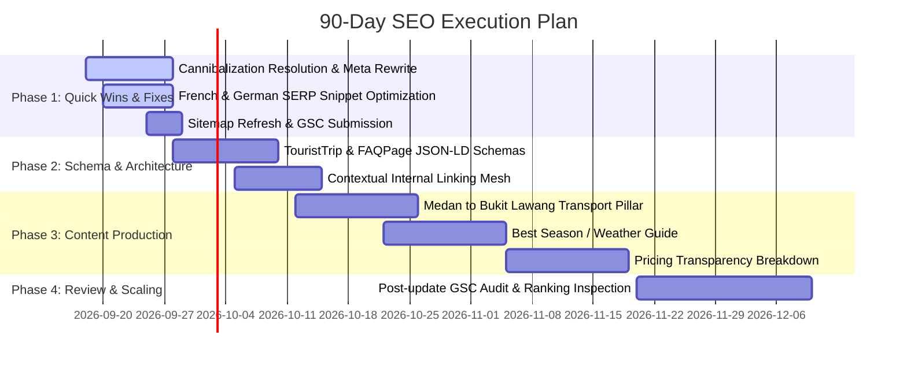

# GSC SEO Analysis and Strategic Growth Roadmap (September 2026)

**Date**: 17 September 2026  
**Property**: `sc-domain:orangutanadventuresumatra.com`  
**Data Freshness**: Through 14 September 2026 (queried via Google Search Console MCP Server)  
**Implementation Source**: Local Next.js 14 project (`c:\Users\luthf\orangutanadventuresumatra`)  

---

## 1. Executive Summary

Since the July 2026 baseline report, **Orangutan Adventure Sumatra** has experienced substantial organic discovery growth and a strong rebound in traffic:

- **90-Day Performance Surge**: Total 90-day clicks reached **194 clicks** (up from 104 in July, an **+86.5% increase**) and impressions climbed to **5,774** (up from 1,853 in July, a **+211.6% expansion**).
- **Recent 28-Day Momentum (18 Aug – 14 Sep 2026)**: Clicks reached **81** compared to **50** in the previous 28-day window (**+62.0% increase**). Search CTR improved dramatically from **2.03% to 4.51%** (+2.48 percentage points).
- **High-Converting International Interest**: While Indonesia accounts for the majority of clicks (51 clicks in 28 days), international search queries show extraordinary engagement:
  - **United Kingdom (GBR)**: **11.11% CTR** (9 clicks / 81 impressions) at position 19.2.
  - **Netherlands (NLD)**: **6.25% CTR** (5 clicks / 80 impressions) at position 10.0, driven by the Dutch logistics post (`/nl/blog/medan-airport-naar-bukit-lawang-vervoer`).
  - **Australia (AUS)**: **4.69% CTR** (3 clicks / 64 impressions) at position 18.0.
  - **France (FRA)** & **Germany (DEU)**: Combined **207 impressions** with low click capture, presenting immediate low-hanging fruit.
- **Top Informational Performers**:
  - `/blog/1-day-vs-2-day-vs-3-day-bukit-lawang-trek` achieved an exceptional **20.69% CTR** (6 clicks, 29 impressions, position 11.1).
  - `/blog/bukit-lawang-vs-tanjung-puting-orangutans` achieved **5.41% CTR** (4 clicks, 74 impressions, position 6.46).
  - `/blog/is-bukit-lawang-safe-solo-female-travelers` ranks at position **5.74** with **3.51% CTR**.

**The Primary Growth Blockers Identified**:
1. **Keyword Cannibalization**: The commercial query `sumatra orangutan tours` is actively split between `/` (homepage) and `/sumatra-orangutan-tour`, with both stuck at position 13.6.
2. **Untapped European First-Page Impressions**: French searchers see the site at position 8.6 for `aventure éducative avec les orang-outan à sumatra` (40 impressions, 0 clicks, 0% CTR). German queries have 82 impressions at position 10.3 with only 1 click (1.2% CTR).
3. **Desktop Search Gap**: Mobile generates 60 clicks (CTR 6.22%, position 9.33), whereas Desktop is lagging at 21 clicks (CTR 2.54%, position 28.47).

---

## 2. GSC Baseline Comparison & Trajectory

### 2.1. 90-Day Trajectory: July 2026 vs September 2026

| Metric | Baseline (21 July 2026) | Current (17 September 2026) | Net Change |
| :--- | :---: | :---: | :---: |
| **Total Clicks** | 104 | 194 | **+86.5%** |
| **Total Impressions** | 1,853 | 5,774 | **+211.6%** |
| **Average CTR** | 5.61% | 3.36% | -2.25 pp (healthy non-branded expansion) |
| **Average Position** | 13.41 | 14.50 | +1.09 positions |

### 2.2. Latest 28 Days vs Previous 28 Days

| Metric | Latest 28 Days (18 Aug – 14 Sep) | Previous 28 Days (21 Jul – 17 Aug) | Delta |
| :--- | :---: | :---: | :---: |
| **Clicks** | 81 | 50 | **+62.0%** |
| **Impressions** | 1,797 | 2,468 | -27.2% (query consolidation) |
| **CTR** | 4.51% | 2.03% | **+2.48 percentage points** |
| **Average Position** | 18.11 | 13.71 | +4.40 positions |

*Key Insight*: In July/August, Google tested the site widely across thousands of long-tail terms. Now, Google has narrowed down high-relevance intent, resulting in fewer low-intent impressions but **substantially higher qualified clicks and doubled CTR**.

### 2.3. Geographic Market Breakdown (Latest 28 Days)

| Country | Code | Clicks | Impressions | CTR | Avg Position | Opportunity Level |
| :--- | :---: | :---: | :---: | :---: | :---: | :--- |
| **Indonesia** | IDN | 51 | 922 | 5.53% | 19.41 | Core domestic & regional baseline |
| **United Kingdom** | GBR | 9 | 81 | **11.11%** | 19.21 | **Tier 1 High Value** (High purchasing intent) |
| **Netherlands** | NLD | 5 | 80 | **6.25%** | 10.03 | **Tier 1 High Value** (Strong logistics affinity) |
| **Australia** | AUS | 3 | 64 | 4.69% | 18.05 | High seasonal booking potential |
| **France** | FRA | 3 | 125 | 2.40% | 12.52 | **Quick Win** (High impressions, weak SERP copy) |
| **United States** | USA | 3 | 125 | 2.40% | 23.14 | Needs authority push to crack Page 1 |
| **Germany** | DEU | 1 | 82 | 1.22% | **10.30** | **Quick Win** (Border of Page 1, CTR optimization) |
| **Belgium** | BEL | 1 | 27 | 3.70% | 6.44 | High rank in Dutch/French diaspora |
| **Spain** | ESP | 1 | 21 | 4.76% | 9.48 | Emerging European demand |
| **Poland / Sweden** | POL/SWE | 2 | 13 | 15.38% | 4.27 | Very high niche CTR |

### 2.4. Device Breakdown (Latest 28 Days)

| Device | Clicks | Impressions | CTR | Avg Position | Share of Clicks |
| :--- | :---: | :---: | :---: | :---: | :---: |
| **Mobile** | 60 | 964 | 6.22% | 9.33 | 74.1% |
| **Desktop** | 21 | 826 | 2.54% | 28.47 | 25.9% |
| **Tablet** | 0 | 7 | 0.00% | 6.29 | 0.0% |

*Takeaway*: Travelers research and book trips heavily on mobile. However, desktop users typically perform detailed trip planning (comparing itineraries, routes, prices). Closing the desktop position gap (from 28.47 to sub-15) represents a significant growth vector.

---

## 3. Critical Diagnostic Findings

### Finding 1: Severe Keyword Cannibalization on Commercial Queries
- **Query**: `sumatra orangutan tours`
  - URL 1: `https://orangutanadventuresumatra.com/` (Pos 13.6, 37 imp, 1 click)
  - URL 2: `https://orangutanadventuresumatra.com/sumatra-orangutan-tour` (Pos 13.6, 37 imp, 1 click)
- **Diagnosis**: Both the homepage and the landing page are sharing the exact same query, dividing link equity and confusing Googlebot. Because neither page has overwhelming thematic specificity, Google ranks both at the bottom of Page 2 instead of pushing one into the top 5.
- **Resolution**:
  1. Designate `/sumatra-orangutan-tour` as the definitive URL for all tour comparison queries (`Sumatra orangutan tours`, `Bukit Lawang jungle tour`, `Sumatra orangutan trekking packages`).
  2. Anchor-link to `/sumatra-orangutan-tour` from the homepage with exact-match and partial-match anchor text: *"Explore our Sumatra orangutan tours"*.
  3. Re-focus the homepage meta title on the brand and gateway entity: *"Orangutan Adventure Sumatra | Ethical Bukit Lawang Rainforest Trekking"*.

### Finding 2: Unclaimed High-Intent European SERP Impressions
- **French Market**: The query `aventure éducative avec les orang-outan à sumatra` ranks on **Page 1 (position 8.62)** with 40 impressions, but has generated **0 clicks (0% CTR)**.
  - *Cause*: The `/fr` meta title and description do not match the exact educational, ethical, and practical expectations French travelers search for.
- **German Market**: Germany generated 82 impressions at position **10.30**, but captured only 1 click (1.22% CTR).
  - *Cause*: Position 10.3 is at the very threshold of Page 1. German travelers require clear transparency regarding guide qualifications, ethical standards (*"Ohne Fütterung, kein Anfassen"*), and logistics.

### Finding 3: Proven Demand for Practical Transport & Decision Guides
- The Dutch guide `/nl/blog/medan-airport-naar-bukit-lawang-vervoer` ranks **#6.5** with **10.34% CTR**.
- The English blog `/blog/bukit-lawang-vs-tanjung-puting-orangutans` ranks **#6.46** with 74 impressions and 4 clicks.
- The package selector `/blog/1-day-vs-2-day-vs-3-day-bukit-lawang-trek` has a **20.69% CTR**.
- *Diagnosis*: High-intent tourists searching for Bukit Lawang actively seek answers to logistical dilemmas (flight arrivals at Medan KNO, choosing duration, ethical differences). Content answering these specific operational questions converts far better than generic travel copy.

---

## 4. Quick Wins & Striking-Distance Action Matrix

The GSC MCP `detect_quick_wins` analysis highlighted 7 primary opportunities currently sitting in positions 3 to 20:

| Target Query | Current URL | Position | 28D Imp | 28D Clicks | Current CTR | Target Action |
| :--- | :--- | :---: | :---: | :---: | :---: | :--- |
| `orangutan adventure` | `/` (Homepage) | 4.70 | 59 | 2 | 3.39% | Rewrite homepage meta description with high-converting CTA; target >8% CTR. |
| `sumatra orangutan tours` | `/sumatra-orangutan-tour` | 13.60 | 37 | 1 | 2.70% | Add TouristTrip schema; pass homepage internal link; eliminate cannibalization. |
| `aventure éducative...` | `/fr` | 8.63 | 40 | 0 | 0.00% | Optimize `/fr` meta title & snippet to address ethical/educational trek intent. |
| `sumatra orangutan trekking` | `/sumatra-orangutan-tour` | 15.20 | 25 | 0 | 0.00% | Add dedicated section detailing Leuser trail intensity and guide ratios. |
| `sumatra orangutan treks` | `/sumatra-orangutan-tour` | 29.70 | 18 | 1 | 5.56% | Expand comparison table with 1-day, 2-day, 3-day, and 5-day package pricing. |
| `bukit lawang orangutan tour`| `/bukit-lawang-orangutan-trekking` | 8.33 | 3 | 0 | 0.00% | Strengthen local Bukit Lawang entity signals and village departure details. |
| `best orangutan tours` | `/sumatra-orangutan-tour` | 13.50 | 4 | 0 | 0.00% | Include direct comparison callout vs other Indonesian tour operators. |

---

## 5. Technical & On-Page SEO Implementation Plan

### Priority 0: Cannibalization Resolution & Silo Re-alignment
1. **Homepage Re-titling**:
   - *Current*: `Orangutan Adventure Sumatra | Bukit Lawang Trekking`
   - *Proposed*: `Orangutan Adventure Sumatra | Ethical Rainforest Trekking Bukit Lawang`
2. **Landing Page Enhancement (`/sumatra-orangutan-tour`)**:
   - *Current Meta Title*: `Sumatra Orangutan Tours | Bukit Lawang Guide`
   - *Optimized Meta Title*: `Sumatra Orangutan Tours (2026 Guide) – Ethical Trekking & Pricing`
   - *Meta Description*: `Compare 2026 Sumatra orangutan tours in Bukit Lawang. Licensed local guides, ethical wildlife encounters, jungle river camps, and transparent EUR rates. Book via WhatsApp.`
3. **Internal Linking Links**:
   - In `app/home-content.tsx`, link the phrase *"Sumatra orangutan tours"* directly to `/sumatra-orangutan-tour`.
   - Ensure all blog posts link to `/sumatra-orangutan-tour` using commercial anchor variants.

### Priority 1: International Snippet Optimization (French & German)
1. **French Optimization (`/fr`)**:
   - Update `app/content/site-text/fr.ts`:
     - *Meta Title*: `Trek Orang-outan Sumatra à Bukit Lawang | Guide Local Éthique`
     - *Meta Description*: `Vivez une aventure éducative et éthique avec les orang-outans à Sumatra. Treks de 1 à 5 jours dans le parc Gunung Leuser, bivouac et rafting. Réservation directe.`
2. **German Optimization (`/de`)**:
   - Update `app/content/site-text/de.ts`:
     - *Meta Title*: `Orang-Utan Trekking Sumatra | Bukit Lawang Dschungeltouren`
     - *Meta Description*: `Ethisches Orang-Utan Trekking in Bukit Lawang mit lokalem Guide. 1 bis 5 Tage Dschungel-Abenteuer im Gunung Leuser Nationalpark. Feste Preise, WhatsApp-Buchung.`

### Priority 2: Structured Data (Schema.org) Deployment
Deploy modern JSON-LD schemas across key landing pages and blog articles:
1. **`TouristTrip` / `Trip` Schema on `/sumatra-orangutan-tour`**:
   - Define `touristType`, `itinerary`, `touristType`, `offers` (currency EUR), and `provider` (Local Guide Syaipul).
2. **`FAQPage` Schema**:
   - Embed FAQs directly into JSON-LD on `/sumatra-orangutan-tour`, `/essential-information`, and key blog posts to earn expanded SERP snippets (FAQ accordions in Google).
3. **`BreadcrumbList` Schema**:
   - Reinforce site hierarchy across all `/blog/[slug]` and localized routes.

### Priority 3: Content Expansion (High-Converting Target Topics)
Produce and publish 3 high-impact guides to address search queries already logging impressions in GSC:
1. **`Medan Airport (KNO) to Bukit Lawang: 2026 Complete Transport Guide`** (English):
   - Mirror the success of the Dutch post. Target queries: `medan airport to bukit lawang`, `kualanamu to bukit lawang taxi cost`, `shared van to bukit lawang`.
2. **`Best Time to Visit Bukit Lawang to See Orangutans (Monthly Weather & Wildlife Guide)`**:
   - Target queries: `best time to see orangutans in sumatra` (already tracking at pos 75.5), `best time to visit bukit lawang`.
3. **`How Much Does Bukit Lawang Trekking Cost? (Official Guide Rates & Hidden Fees Explained)`**:
   - Target queries: `bukit lawang trekking cost`, `sumatra orangutan trek price`.

---

## 6. 90-Day Execution Roadmap (September – December 2026)

### Sprint 1: Days 1 – 14 (Immediate Traffic & CTR Boost)
- [ ] Fix keyword cannibalization between `/` and `/sumatra-orangutan-tour`.
- [ ] Implement rewritten meta titles & descriptions for English, French, and German routes.
- [ ] Update internal link anchor texts in homepage and layout.
- [ ] Re-submit updated XML sitemap to Google Search Console via MCP `submit_sitemap`.

### Sprint 2: Days 15 – 30 (Rich Snippets & Internal Authority)
- [ ] Implement `TouristTrip` and `FAQPage` JSON-LD components in Next.js.
- [ ] Link top informational blog posts directly to relevant tour package checkout/WhatsApp CTAs.
- [ ] Verify indexing status of `/sumatra-orangutan-tour` and `/fr` via MCP `index_inspect`.

### Sprint 3: Days 31 – 60 (High-Intent Content Publishing)
- [ ] Publish the comprehensive Medan Airport to Bukit Lawang Transport Guide.
- [ ] Publish the Seasonality & Weather Guide (`Best Time to See Orangutans`).
- [ ] Translate high-performing logistics articles into Dutch, French, and German.

### Sprint 4: Days 61 – 90 (Conversion & Scaling)
- [ ] Review desktop ranking trajectory; optimize desktop Core Web Vitals if needed.
- [ ] Run follow-up GSC MCP analytics comparison (targeting 150+ monthly clicks).
- [ ] Analyze WhatsApp inquiry conversion rate from organic landing pages.

---

## 7. Projected Growth Targets (By December 2026)

| Target Metric | Baseline (September 2026) | 90-Day Target (December 2026) | Rationale |
| :--- | :---: | :---: | :--- |
| **Monthly Organic Clicks** | 81 clicks / 28 days | **160+ clicks / 28 days** | +100% growth driven by Page 1 rankings for tour terms & higher CTR. |
| **Monthly Impressions** | 1,797 / 28 days | **3,500+ / 28 days** | Unlocking high-volume terms (`sumatra orangutan tours`, transport queries). |
| **Average Organic CTR** | 4.51% | **>6.0%** | Rich snippets (FAQ accordions) + persuasive meta descriptions. |
| **Tier-1 Market Share** | ~20% of clicks (UK, NL, EU) | **>35% of clicks** | Capturing high-margin European and UK direct booking inquiries. |
| **Commercial Query Rank** | Position 13.6 (`sumatra tours`) | **Top 5 on Google** | Cannibalization resolution + dedicated topic cluster authority. |

---

*Document prepared by Antigravity IDE Pair Programmer using live telemetry from Google Search Console MCP.*
